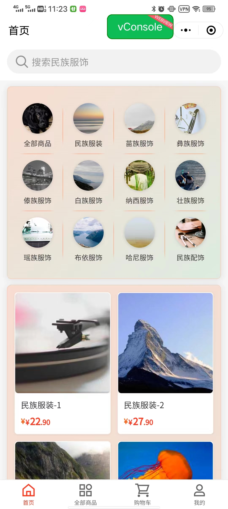
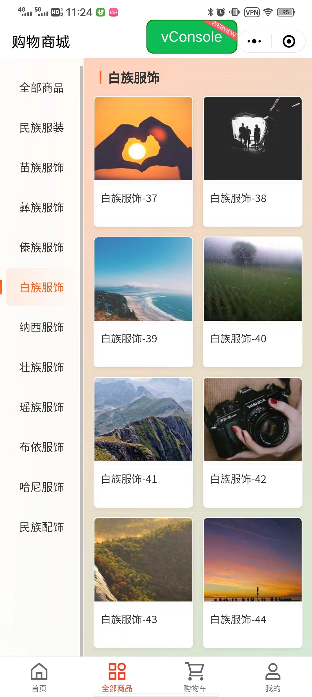
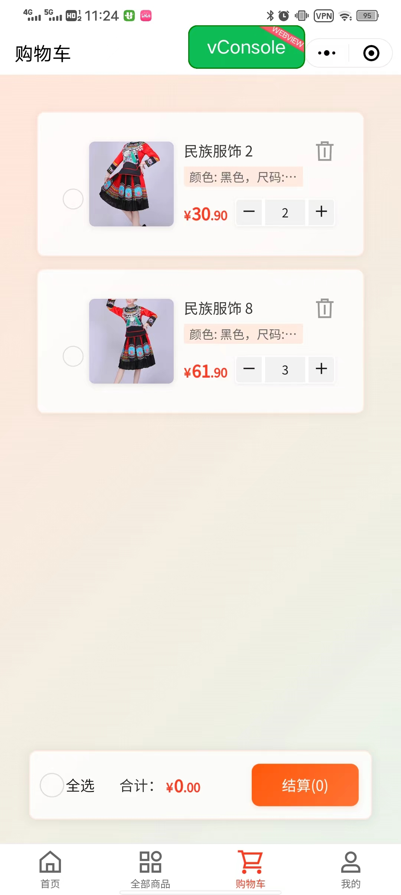
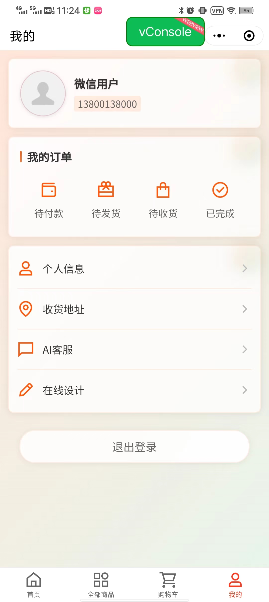
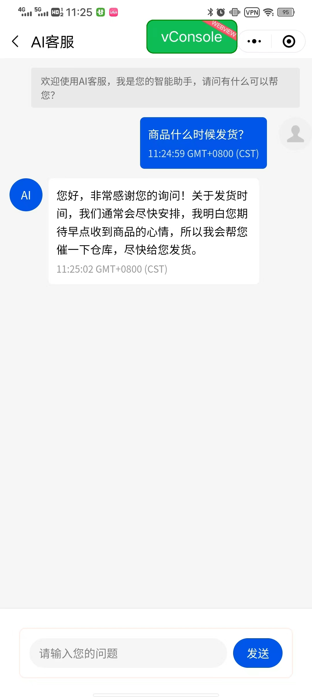
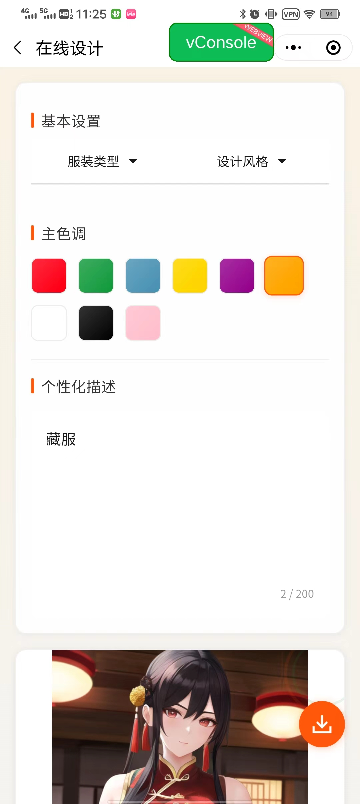

# NatureE

基于微信小程序开发的云南特色服装购买与设计平台，集成了 AI 设计、在线商城等功能。

## 项目截图

|首页|商品列表|购物车|
|---|---|---|
||||
|**个人中心**|**AI客服**|**在线设计**|
||||

## 主要功能

- 🎨 AI 智能设计
  - 支持多种云南民族服装风格
  - 自定义颜色和设计元素
  - 集成 Stable Diffusion 模型

- 🛍️ 商城功能
  - 商品浏览和搜索
  - 购物车管理
  - 订单管理

- 👤 用户中心
  - 用户登录注册
  - 个人信息管理
  - 收货地址管理

## 技术栈

### 前端
- 微信小程序原生开发
- TDesign 小程序组件库
- 自定义组件封装
  - 购物车组件
  - 商品列表组件
  - 在线设计组件

### AI 能力
- Stable Diffusion WebUI
  - 基于秋叶整合包
  - 支持 LoRA 模型
  - 自定义提示词优化
- 百度云 AI 客服集成

## 环境要求

1. 微信开发者工具
2. Stable Diffusion WebUI（秋叶整合包）
- 使用秋叶整合包，已默认启用 API 功能
- 默认端口 7860

## 本地开发

1. 克隆项目
```bash
git clone [repository-url]
cd [project-name]
```

2. 使用微信开发者工具打开项目

## 注意事项

1. 在线设计功能需要本地运行 Stable Diffusion WebUI（使用秋叶整合包启动即可）
    1. 开发者工具中，需要在“详情”中勾选“不检验”才能使用在线设计功能
    2.  真机调试中，需打开调试才能使用在线设计功能（使用frp）
2. 小程序发布时需要配置合法域名
